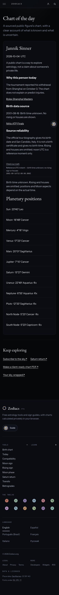
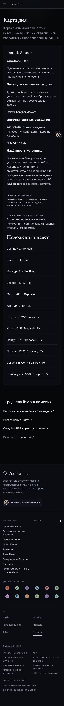

# Approved edition: October 4, 2026

The owner approved the previously reviewed Jannik Sinner edition on October 4. The approval record in `src/data/chart-of-the-day.json` covers this dated edition only. Future figures still need individual approval.

The [official Nitto ATP Finals biography](https://www.nittoatpfinals.com/en/players/singles/jannik-sinner) gives August 16, 2001 and San Candido, Italy. It supplies no birth time and is not a birth certificate. The [official Shanghai tournament report](https://en.rolexshanghaimasters.com/en/media/news/sinner-shanghai-2026-withdrawal), dated October 3, supplies the news reason. Both sources were reopened before publication; no photograph or article text was copied.

## What changed

Six dated pages publish the approved chart with translated news context and source reliability. Calculations run in the browser at **2001-08-16T12:00:00Z, explicitly a reference instant**. No birth time, rising sign or houses are invented. The chart does not explain or predict injuries. Source-link labels use the sources' proper names, consistently across languages.

The hub offers the current dated edition once. Past editions remain archive links; a missing approval never silently promotes yesterday's figure as today's. The dated pages have reciprocal language links, canonical URLs and sitemap entries. The hub remains noindex.

The chart loader now uses the existing translated retry action and explicit reload recovery for a failed code download. A generic load error is translated into all six languages.

## Validation

The static build, schema, artifact, locale and unchanged bundle gates pass. Type checking reports no errors or warnings and 39 existing hints. The 18 reader-template captures were refreshed against the October 4 daily data.

The publication browser drive covers Chromium and WebKit at 360, 390 and 1280 pixels, all six mobile translations, sources, 12 reference positions, UTC receipts, omitted angles, sitemap/language metadata, no horizontal overflow, no browser/CSP errors, and all six translated failed-download/reload journeys. It also verifies that the next unapproved date returns 404 and cannot become today's edition. CI runs this as a required step.

The full suite initially found an older sky API test assuming every future event has a strictly positive rounded `daysAway`. October 4 includes a sufficiently near event that correctly rounds to 0.0 days. Its exact timestamp was already future. The test now checks the exact one-decimal value, preserving the timestamp/window checks; a synthetic thirty-minute boundary regression was added. The API's behavior is unchanged.

The final local suite passes **6,478 tests**, with five deliberate skips. The publication browser drive passes **24 groups**. The [local receipt](chart-of-the-day-2026-10-04/local-checks.json) and [browser observations](chart-of-the-day-2026-10-04/browser-observations.json) record those checks. Required exact-head CI and live verification belong to the pull request and final release handoff. No failing test is treated as completed.

## Limits

These are reference positions, not a verified timed natal chart. The biography is a primary public source rather than a civil birth record. No automatic future editions or publication schedule were enabled. This approval does not authorize any new person or a different date.

