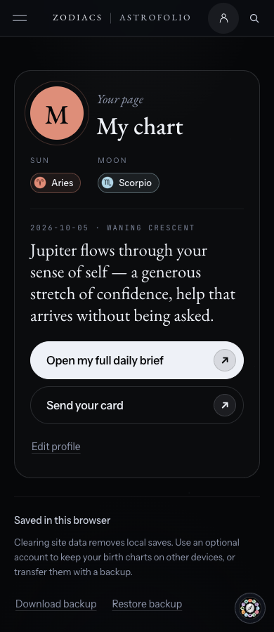
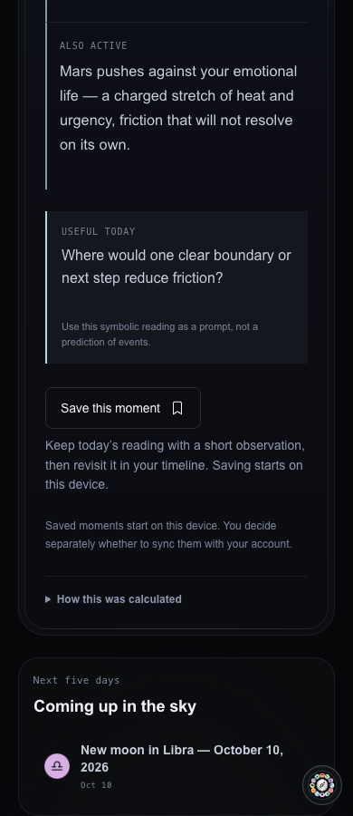

# Consumer interface polish — October 6, 2026

The owner reported a missing Astrofolio link on Profile, an overdecorated “Save this moment” button, and the upcoming-sky panel touching the card above it. They requested a sweep for similar issues and fixes.

Changes:

- Restore the existing Astrofolio destination in Profile's header, menu and footer, across all six languages. Preserve the existing localized destination descriptions and operator disclosure. Calculator and Today navigation still omit it. Profile's private-surface classification and other uses of that classification remain unchanged.
- Replace the bright save pill and nested plus circle with a compact outlined bookmark button. Put its existing explanation beneath it. Match the initial placeholder to the loaded control so its geometry is stable. Saving, consent and privacy wording are unchanged.
- Give Today’s upcoming-events panel a responsive 24–32px gap from the reading above. The horoscope template already has its own 26px grid gap and keeps it.
- Make the upcoming panel’s small labels easier to read, use sentence case, and prevent an event without a sign icon from squeezing into the icon column.
- Give Guide's suggested-question links a 44px minimum tap height and the site's small corner radius. Prompts still open as unsent drafts.

No new display strings, calculation behavior, birth-data handling or external assets were introduced. Screenshots use a synthetic locally saved chart.

Validation:

- Production build and type checks passed (zero errors, zero warnings; 39 existing hints).
- The consumer sweep passed 92 cases: Chromium checks 19 routes at 320, 390, 768 and 1440px; WebKit checks Profile, Today, a daily horoscope and Russian Profile at those widths. Routes cover the homepage, Profile in all six languages, Today, horoscope hub and reading, tool hub, birth chart, compatibility, sky calendar, sign guide, Learn, About, Astrofolio and a Registry profile.
- Checks cover horizontal overflow, Profile destination visibility, tool branding, Guide tap targets, save-button shape, help-text placement, the upcoming-events gap, and opening/cancelling the composer with focus restored.
- The 50 focused trust, claim-ledger and layout tests passed. Two assertions still described the previous markup and were updated; the existing privacy sentence was registered at its new placeholder location without changing its wording.
- The source-bound Phase 1 screenshot receipt was refreshed from successful CI run [37352909439](https://github.com/zodiacs-org/site/actions/runs/37352909439), captured at commit `20a60ba14de0a80a81ad7a7975cea4ff3af26085`. Every downloaded file was verified against the provenance byte length and SHA-256 before copying only the Phase 1 screenshots and manifest. The source hash is `7c81f70e6a8aeda060559ace4cb66d7fa57e4442c549a64c99633276b39afbd0`. Visual baseline candidates were not adopted.
- The existing 390px/1440px visual comparison passed in run [37352909427](https://github.com/zodiacs-org/site/actions/runs/37352909427); its longer Lighthouse checks remain pending.
- The full local test suite passed: 519 files, 6,747 tests; 5 tests skipped. The default-concurrency run passed every assertion but reported a worker RPC timeout; rerunning with `--maxWorkers=4` completed cleanly.
- The pre-receipt CI run failed its stale screenshot receipt and an existing Profile browser-test hydration race. This branch refreshes the receipt and makes that browser test wait for the mounted client panel, preserving the spacing assertions. Final remote CI must clear before merge.

This change is based on current main (`550c6768`), separate from the earlier compact-navigation PR #651. It does not change the navigation bar's desktop styling or breakpoints. The Profile link itself is the owner-requested addition.

Preview only under the owner's existing preview-before-live instruction. No production deployment or merge has been performed.

Hosted preview: [Profile](https://zodiacs-h891tz4t6-zodiacsofficial.vercel.app/profile/) · [Today](https://zodiacs-h891tz4t6-zodiacsofficial.vercel.app/today/). Deployment `dpl_GrEQxAABSzyJxqLMCdfJCnKSgp3G` reports READY with target preview.

Screenshots from the local production build, using a synthetic saved chart:

