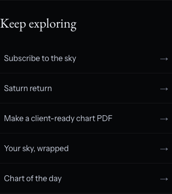
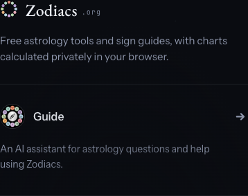
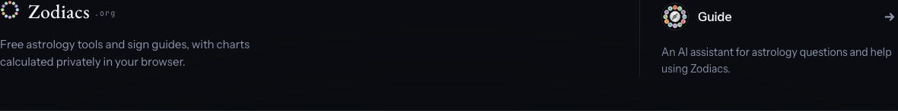

# Profile discovery and Guide introduction

Owner request: tidy the profile’s “Keep exploring” destinations, and separate Guide with a plain explanation of what it is.

- Replaced wrapping underlined links with a quiet directory: full-width rows on mobile, two columns on desktop, separate trailing arrows, visible keyboard focus and tap areas at least 60 px high.
- Removed the stacked section padding around the profile directory. It now aligns with the 780 px profile content.
- Gave Guide a separate footer region with a divider, portrait, opening action and the explanation “An AI assistant for astrology questions and help using Zodiacs.” All six languages include translated explanatory copy; the existing Russian English-only cue remains.
- Updated shared Astro, generated Registry, mounted Registry and Thesis full footers. Compact documentation footers retain their existing layout. Advanced the footer stylesheet URL to avoid stale styling on returning visits.
- Retained the existing Guide dialog, consent flow and privacy text. No account, chart, engine, pricing or disclosure changes.
- Corrected the earlier profile-recovery browser test’s waiting condition: the now-always-available editor cannot indicate that the account’s charts have finished loading. It now waits for the actual recovered fixture chart before making the same assertion.

## Review images

## Validation

- Production build: passed, including link integrity and bundle budgets.
- Astro/type, footer consistency and consumer boundary checks: passed (0 errors, 0 warnings; existing hints only).
- Phase 1 screenshot receipt: passed, 18/18 exact-width captures refreshed.
- `tests/footer-discovery-drive.mjs`: 32 cases passed. Profiles in all six languages at 320/390/611/1440 px; Chromium and WebKit coverage; Registry, Thesis and sky-calendar shared surfaces. Checks include overflow, tap areas, separated arrows, valid destinations and Guide opening/closing. Added to CI.
- Unit suite: 6,757 tests passed on the broad run; nine footer-loader expectations still referenced the old stylesheet URL. Updated that fixture to the new URL; all 10 tests in that file now pass. Combined coverage: 6,766 passing tests, six existing skips.
- Simulated profile recovery: 40 checks passed across Chromium and WebKit using a separate build configured with a loopback-only mocked account service. No real account service or email was used. The first attempt correctly exposed that the default local build lacks account-sync configuration; the configured run passes.
