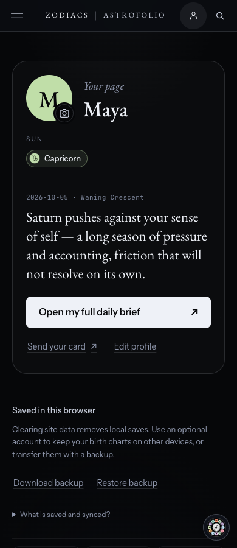
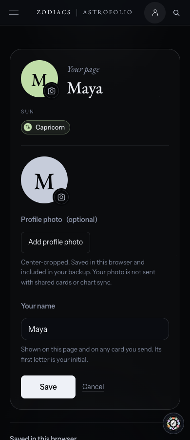

# Profile and consumer polish release — October 6, 2026

The owner asked for a cleaner saved-profile page, better photo controls, and explicitly instructed: “Then push everything live.” This supersedes the preview-only instruction for this combined release.

The profile header now has a single avatar edge and a visible camera affordance, a compact primary action and quieter secondary actions. Its existing reading uses a calmer type scale. Editing hides the reading temporarily so the photo and name fields sit together near the top. The native file-picker chrome is replaced with a labelled button and a larger inline preview. Save, cancel, invalid-file handling, JPEG preparation, metadata removal, backup inclusion and local-only photo storage retain their existing behavior. Closing an avatar-initiated edit restores focus to the avatar.

All labels reuse existing text; no new display copy or legal wording. Profile photos remain excluded from shared cards and account chart sync.

This release also includes the previous Profile Astrofolio link, Today save control, upcoming-events spacing, Guide tap targets, and approved navigation consistency work from #651. The existing desktop navigation rows remain unchanged.

Validation is recorded in PR #658. Phase 1 screenshots were recaptured from the combined production build using the repository acceptance driver (18 exact-width captures); no visual regression baselines were replaced. Two browser assertions now wait for the actual focus restoration, and navigation width is measured against the content viewport so WebKit's classic scrollbar is accounted for.

Synthetic local chart used in screenshots:

