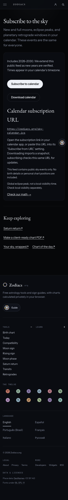
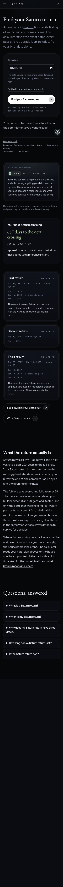
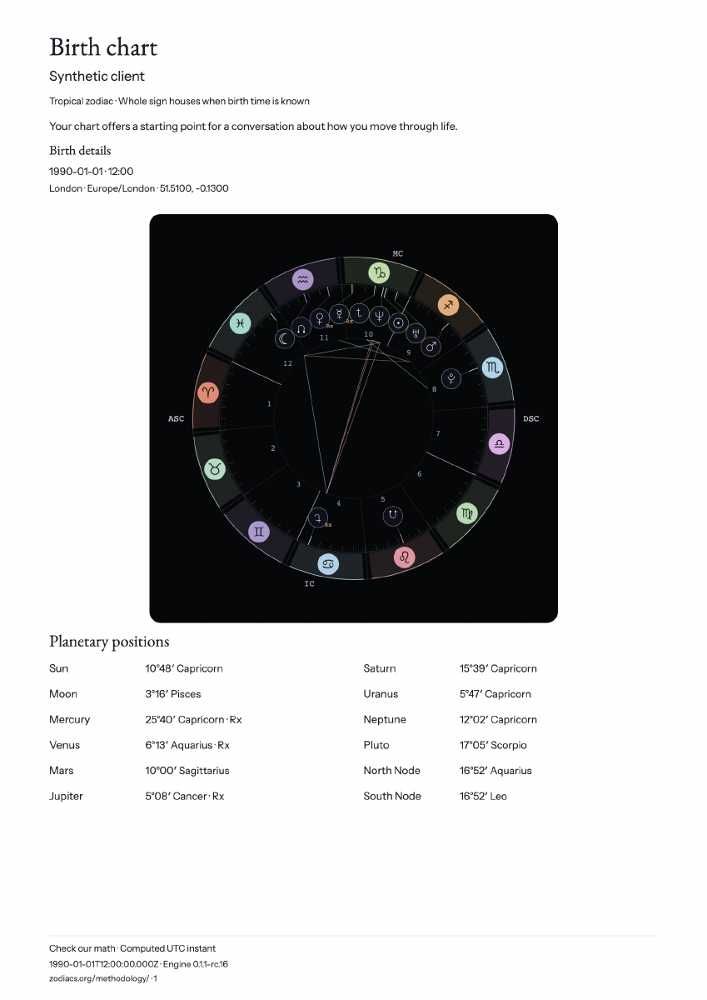
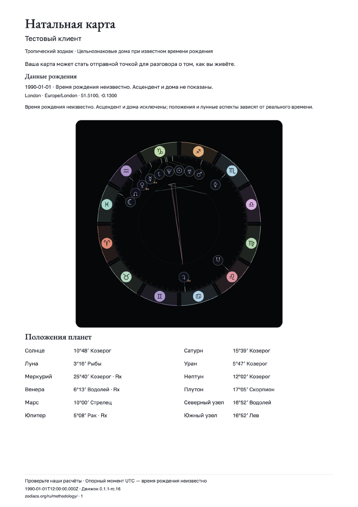
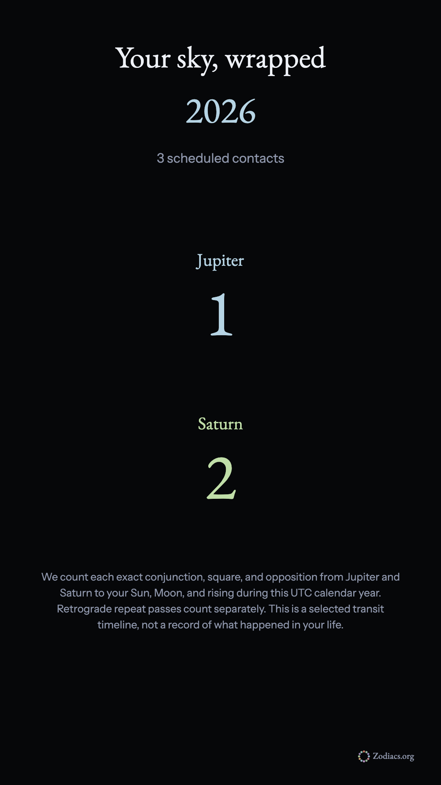
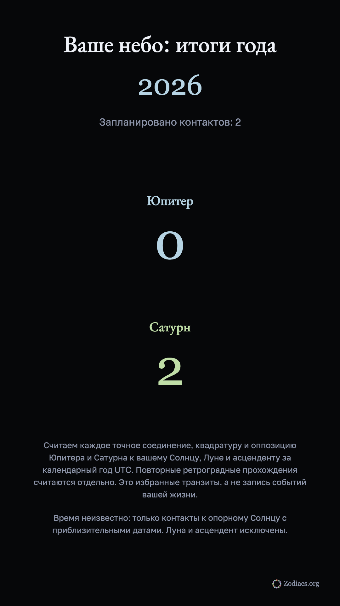

# Phase 3: return visits and search

The owner said “Start phase 3.” Four tools are ready to release in all six languages. The Chart of the day publishing framework is ready, but the first real figure remains unpublished pending the owner's approval of that dated edition. No account, payment, wallet connection or signature is required for these tools.

| Item | What changed | Validation | Limits and uncertainty |
| --- | --- | --- | --- |
| 10. Calendar subscribe | `/sky-calendar/` offers a public `.ics` subscription and a separate snapshot download, in six languages. It contains 195 verified events: 124 new/full moons, 24 eclipse peaks and 47 retrograde windows for 2026–2030. Calendar UIDs are stable across languages. | Source-count, UTC, byte folding, event-type and stable UID tests; all six rendered feeds; official Vercel header compiler receipt and isolated calendar MIME/cache rules. Mobile subscription pages pass in all six languages. | Events are universal sky facts, with no chart input. Eclipse peaks do not establish local visibility. Windows clipped by the feed boundary are labelled accordingly. Calendar apps control refresh timing. We extend the committed feed when new years are verified; downloading imports a snapshot. |
| 11. Saturn countdown | The existing Saturn return result shows UTC calendar days to its next exact crossing, including repeated retrograde passes. It updates once a minute and clears when an input changes. | Actual engine results in Chromium and WebKit at 360, 390 and 1280 pixels; all six mobile translations; UTC midnight, same-day and exhausted-window tests. | A date-only calculation is explicitly approximate. After the final searched crossing, the tool says there is no further crossing in that searched window, rather than claiming there will never be another return. |
| 12. Chart of the day | Six-language dated routes, a current-day selector, source links, translated reliability/news explanations, and a browser-calculated unknown-time chart. A strict manifest requires each edition's explicit owner approval, HTTPS sources, valid dates and recent news. The empty hub is noindex. | Invalid, unapproved, unsourced, future-birth, stale-news and missing-translation fixtures are rejected. A temporary fictional local fixture passed the full build, metadata gates and all six mobile dated pages; it was restored before the release build. | **First real edition is not done or published.** Jannik Sinner for October 4 is a separate owner-review draft. His official tour biography documents date/place, not a birth certificate or time. No rising or houses are inferred. Each future dated figure needs its own approval; a previously approved edition is never silently relabelled as today's. |
| 13. Astrologer kit | `/astrologer-kit/` makes an A4 client PDF entirely in the browser: name/nickname, entered birth details, chart wheel, positions, whole sign houses when time is known, aspects/orbs and a UTC calculation receipt. Every page has a clickable localized methodology badge. The name is optional. | Browser-made PDF downloads in both engines at all three widths; all six unknown-time PDF exports; PDF xref/A4/public URI tests; actual PDF pages rendered and visually reviewed. Public sign artwork loads all twelve signs independently of the chart. Changing the form clears a prepared export. | The PDF intentionally includes the entered client details; the download screen says to review it before sharing. Unknown time omits angles/houses and Moon aspects from both diagram and tables. Its other positions are clearly reference positions. Pages are rasterized for dependable six-script rendering: text is not selectable/searchable, and the PDF is not tagged for screen readers. |
| 14. Your sky, wrapped | `/your-sky-wrapped/` is available now, ahead of December 1. It recomputes a selected saved chart on the device, scans an annual timeline in a cancellable worker and prepares a 1080×1920 share card. A year still in progress marks future contacts as upcoming. | Exact contacts agree with the existing crossing solver; both browser engines, three widths, all six image exports, active native-share taps and PNG dimensions. Held-worker tests verify cancellation and year changes discard stale results. Saved-chart deletion invalidates exports. Request traces contain neither birth dates nor chart inputs. | This is an explicitly selected annual review: Jupiter/Saturn conjunctions, squares and oppositions to Sun/Moon/rising, with each retrograde pass counted separately. Unknown time uses approximate reference-Sun contacts only. The card contains the year and counts, without name, birth details, natal degrees or individual contact dates. It does not claim to describe what happened in someone's life. Real iPhone share sheets still need a physical-device check; WebKit tests verify tap activation and the download fallback. |

Tools and saved-profile pages offer localized links to the new tools. Every new computed result retains a human opening and its actual UTC/reference receipt. Tool navigation and footers contain no Astrofolio branding. Personal forms use the existing private-surface setting to omit third-party analytics scripts. Existing account sync is unchanged.

## Pictures

These use synthetic test charts only.

The [first daily figure draft](return-visits-phase3-2026-10-04/day-candidate.png) is awaiting a separate approval; it is not a live edition. Its [source record](return-visits-phase3-2026-10-04/day-candidate.json) has `ownerApproval: null`.

## Release evidence

The local static build, artifact integrity, consumer boundary, schema, language/hreflang, generated context, scope and bundle gates pass. Astro check reports 0 errors, 0 warnings and 39 existing hints. Vitest passes 6,476 tests across 510 passing files; five deliberate skips remain. The 18 existing reader-template captures passed and remain pixel-identical; their source receipt was refreshed.

The new browser drive passes 51 groups in Chromium and WebKit over HTTPS with the unmodified production CSP, at 360, 390 and 1280 pixels. It covers all six languages, file exports, native-share activation, worker cancellation, deleted records, complete sign-art requests, no horizontal overflow and no birth-data request. CI runs the Chromium drive as a required Build & Check step and retains its artifacts. The test's temporary HTTPS certificate is local only and is deleted on cleanup; production certificate verification is never bypassed.

Earlier development checks found a missing SVG namespace in the PDF wheel and the new route families missing from the consumer-navigation classifier. Both were fixed. Unknown-time Moon aspects were also removed from the PDF diagram to match its table. The claim ledger and old route-count fixtures were updated with evidence, without dropping their assertions. A Safari failure under a local HTTP preview came from the existing `upgrade-insecure-requests` directive, so the test now exercises actual HTTPS instead of weakening CSP. Screenshots visit the page ending and wait for its deferred stylesheet before capturing it.

Four new Russian share previews bring the committed Russian OG family to 659.5 KiB. Its aggregate ceiling grows from 600 to 700 KiB for the four additional routes, with its per-image checks intact. No earlier previews were regenerated and no initial-page bundle limit was raised. Birth Chart remains 65.8 KB gzip under 71 KB, Compatibility 35.6 KB under 36 KB, and engine isolation passes.

Machine-readable [local checks](return-visits-phase3-2026-10-04/local-checks.json), [browser observations](return-visits-phase3-2026-10-04/browser-observations.json), and the [official routing-compiler receipt](return-visits-phase3-2026-10-04/vercel-routes.json) accompany this report. Exact-head CI and production verification belong to the pull request and final owner handoff; the local evidence alone does not claim a live release.
