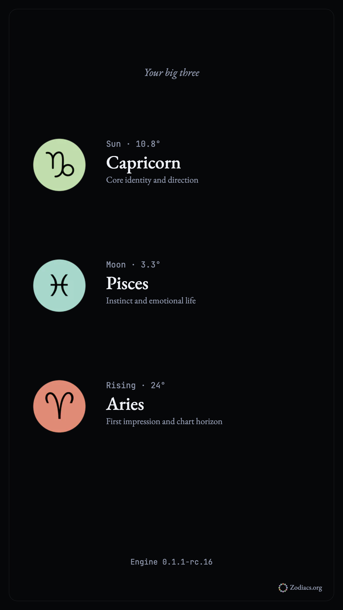
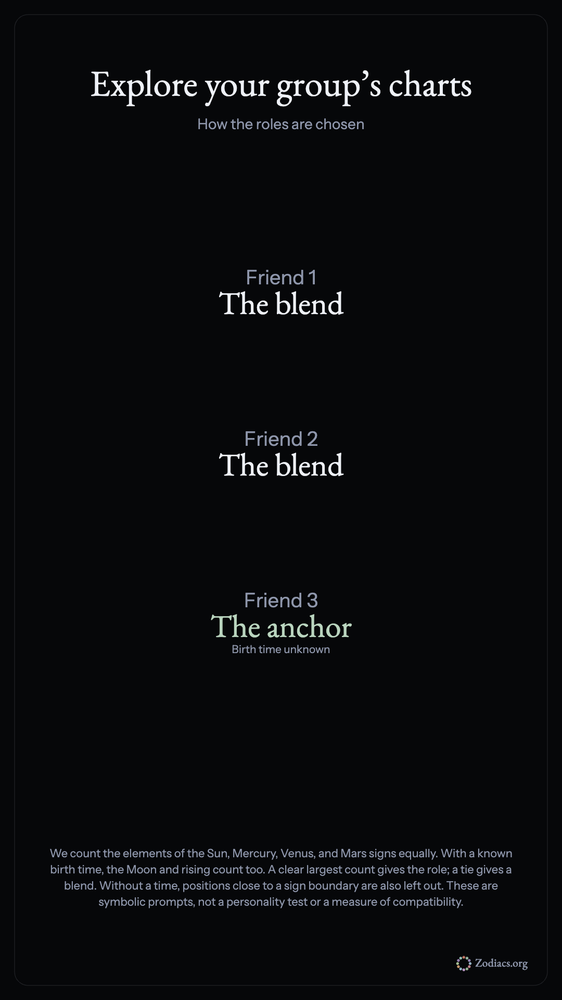
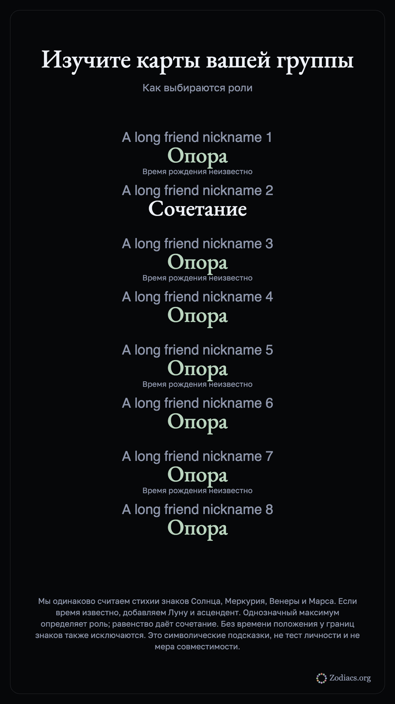

# Phase 2 owner review — 2026-10-03

This release implements items 6–9 only. Phase 3 is not started.

| Item | Change | Verification | Limits and uncertainty |
| --- | --- | --- | --- |
| 6. Big Three card | A prepared 1080×1920 browser image, shared in one tap or downloaded. Editing an input removes the old result and export. | Chromium and WebKit at 360, 390 and 1280px; portrait dimensions, tap activation and stale-result invalidation; recovery unit tests. | The native share sheet is represented by a browser harness, not a physical iPhone. Unknown time routes to the full chart calculator; rising is never invented. |
| 7. Compatibility invite | A free link with planetary positions in its URL fragment. No original birth date, time, place, coordinates or name field. A friend adds their chart locally. Valid second links replace the old comparison; malformed links show an error. | Wire-field allowlist, minute/angle rounding and unknown-time reference tests; both browser engines; request query/body canaries and no account-invite API calls in the new flow. | Anyone holding the link can read its positions, which can suggest an approximate birth date. The notice states this. The original UTC receipt is unavailable to the recipient. Old fragment links still decode for continuity. |
| 8. Group charts | Three to eight people, equal element counts, symbolic roles, transparent placement basis and an optional local portrait export. | Both browser engines at three widths; add/remove boundaries; eight-person exports in all six languages; ties, missing angles and unknown-time boundaries tested. | Roles are symbolic prompts, not a personality test or measured compatibility. Unknown times omit Moon and rising; unstable boundary positions are excluded. The image contains entered names or nicknames, with an instruction to ask everyone before sharing. |
| 9. Chart twins | Matches from the 104 publicly listed, sourced directory profiles. Verified Sun and stable Moon matches come first; one-sign matches remain available. | Both browser engines; ranking and uncertainty unit tests; source links; unknown user times only compare Sun and show those matches immediately. | As the owner approved, no rising comparison or three-sign twin claim: the directory has no verified birth times. A shared sign does not establish personality similarity. English-only directory pages are labelled as such on translated tools. |

All tools remain free and require no account. New routes and strings ship in English, Spanish, Brazilian Portuguese, French, Italian and Russian. Tools and Compatibility link to the new surfaces. Every computed result retains its actual UTC receipt and a human opening. No wallet or transaction flow is added.

## Pictures

Synthetic examples only. These are actual browser-generated downloads.

## Release checks

The final static build passes artifact, schema, locale, English-link and bundle gates. Big Three starts at 27.6 KB gzip under its 30 KB budget; Compatibility starts at 35.5 KB under 36 KB. The four Russian sharing previews retain the 600 KiB family ceiling; earlier Russian previews remain byte-identical.

Astro check: 0 errors, 0 warnings (39 existing hints). Browser acceptance: 51 passing groups in Chromium and WebKit, 24 localized tool routes, all six eight-person exports, no horizontal overflow or page errors. The CI production-flags job now runs this drive and retains its screenshots.

The required 18 existing reader-template captures were refreshed against the new source fingerprint; all 18 passed. See `docs/acceptance/phase1/screenshots/manifest.json` and the sharing observations beside these sample images.

Initial Phase 2 Vitest suite: 6,377 passed, 5 intentionally skipped, 508 passing files and one skipped file. Exact-head CI and deployment evidence are attached to the pull request and recorded in the final owner handoff. Earlier development failures found overwritten form edits, an uncaught birthplace-index preload rejection, and same-page invite navigation; these were fixed before release. Tests also exposed the need to update route counts, generated Guide context, wordmark expectations and the claim ledger without weakening their gates.

## Privacy follow-up

The first live WebKit run reported a ResizeObserver notification on Big Three. Instrumentation identified the observer in the remote Plausible analytics script; five targeted repeats were clean. Sharing and compatibility forms now use the existing `privateSurface` setting in all six languages, which omits third-party analytics scripts while keeping the tools and Guide available. The error assertion remains unchanged. A source-boundary regression and rendered-page checks cover this setting; all 18 reader-template captures were refreshed again. Final full-suite, browser and live verification evidence is recorded on the follow-up pull request and in the owner handoff.
