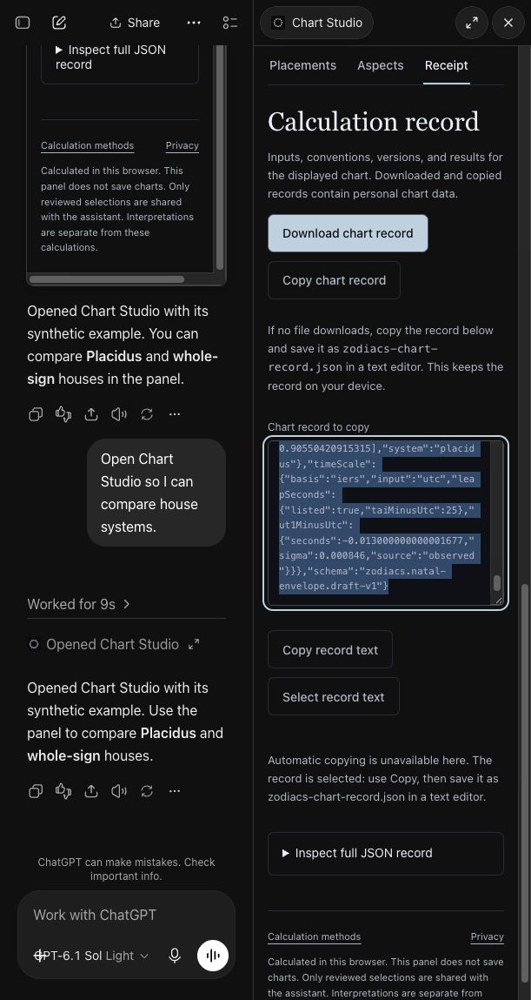

# Native review — 6 October 2026

Package 0.3.2, runtime 0.3.0, vendored engine rc.17. This is partial acceptance in the actual ChatGPT host using synthetic data, not a public-release or 9/10 claim. The deployment and bundle/archive digests are in [verification.json](./verification.json).

The calendar, explicit sky calculation, timezone-ambiguous ingress answer, canonical calculator link and Chart Studio opened in the native conversation. Studio house comparison, repeated-clock review, time stepping, worker completion, record reproduction and explicit selection sharing were observed. The three negative prompts produced no unsupported completion: stock and relationship guarantees were refused; the meeting prompt asked for clarification but did not explicitly state the plugin's missing calendar-write access.

ChatGPT's sandbox blocked direct file downloads. The updated panel offers local copying and explains how to save the record. Automatic clipboard access is also blocked in this host; the panel selects the full text and shows manual-copy instructions. An actual Copy shortcut produced all 5,598 characters, byte-for-byte equal to the displayed valid JSON. The saved [synthetic record](./native-copied-chart-record.json) came from that clipboard operation, not a substitute DOM extraction. The copied JSON was then pasted into native Record A and reproduced with rc.17. No chart record was uploaded to a file service. The v2 resource URI prevents stale cached HTML; v1 remains readable for older approved tool metadata.

## Limits and incident

A private deployment briefly used the general MCP bundle where the dedicated OAuth wrapper was required, causing two failed native Studio attempts. The alias was rolled back immediately. The correct preview builder and a wrapper-export preflight resolved it; the final deployment's metadata/config return 200, and unauthenticated MCP/worker calls return 401. No production alias changed. The successful later opening does not erase the failed attempts.

The refreshed app details list all three event types. The old conversation still had no event action, but a fresh Work chat created a real native Moon ingress watch. The database confirms callback verification, Moon/Asia-Bangkok filters and finite expiry. Pausing that task stopped the server subscription (revision 2, inactive) and cleared its callback credentials; no polling substitute was used. No real event arrived during this short test, and automatic renewal remains unverified. [Server lifecycle evidence](./native-watch-lifecycle.json). Worker windows completed before a cancellation click could be tested, so native cancellation is also pending. These screenshots are evidence, not a walkthrough video or independent beta feedback.

The website's mobile bio footer hid only the Guide button after the shared footer gained help text. Hiding the complete help block restores the intended compact footer: 399px at 390/412px viewports and 422px at 320px. Existing 460px checks were retained. [Browser measurements](./bio-mobile-footer.json).

Refreshing tools also reset the cloud profile to generic metadata. A complete metadata-only 1.0.2 ZIP referencing the same app restored its icon, Zodiacs LLC, website, privacy and terms; the updated profile was verified.

Business verification is in review according to the owner's submission; approval is not established. Public submission, merge and production activation remain reserved for owner review. The current package has no completed reviewer-accessible walkthrough video.
